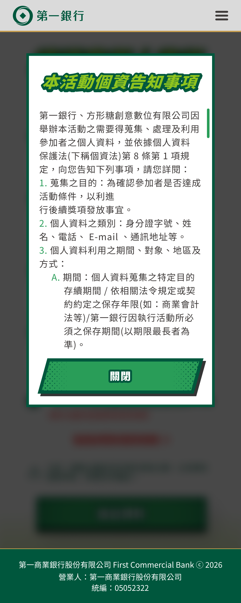
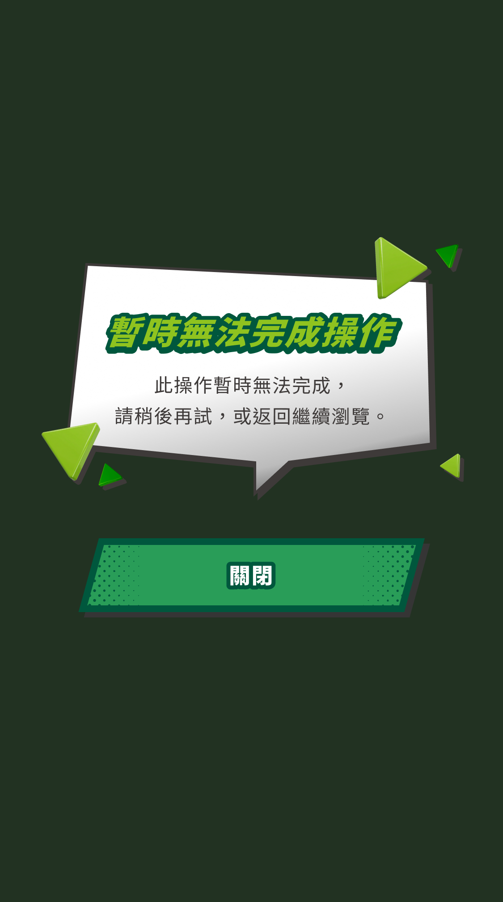

# 一銀 2026 5 月大活動

## 網站地圖

- Home 網站首頁
- Game 遊戲頁面
- Loading 讀取畫面 (遊戲完成後使用)
- Mission 交易任務頁 (開戶抽萬元現金)
- Result 互動結果
- Form 留資頁面
- Complete 登記成功頁
- Activity 活動辦法

## 行動裝置縮放比例

- 手機倍率 = 1
- 平板倍率 = 1.5

```html
<p class="m:mt-[18px] t:mt-[27px]">TEST</p>
```

## 參數調用方法

取得網站狀態

```js
const global = globalStore()

/**
 * 狀態代碼
 *
 *      0: 上線前
 *      1: 遊戲開放中
 *      2: 活動已結束
 */
const status = global.status
```

取得遊戲狀態

```js
const game = gameStore()

/**
 * IsFinish 是否完成遊戲
 * IsSubmit 是否送出資料
 * Score 遊戲分數
 */
const { IsFinish, IsSubmit, Score } = game.status
```

送出遊戲結果

```js
const game = gameStore()

// 寫入分數
game.score = 10
game.score += 5

// 送出資料
const result = await game.apiFinish()

if (result) {
  // 回傳成功
}
```

送出留資表單

```js
const global = globalStore()

// 送出資料
const result = await game.apiFinish()

if (result) {
  // 回傳成功
}
```

## 頁面跳轉判斷

### 網站首頁 `[Home]`

進入不需任何判斷

顯示判斷

- 活動開放中 `global.status === 1` -> 顯示開始挑戰按鈕
- 活動已結束 `global.status !== 1` -> 提示活動已結束

### 留資頁面 `[Form]`

- 未玩過遊戲 `IsFinish = false` -> 跳轉到首頁
- 已填過資料 `IsSubmit = true` -> 跳轉結果頁

### 結果頁面 `[Result]`

跳轉判斷

- 外部連結進入 -> 未玩過遊戲 `IsFinish = false` -> 跳轉到首頁
- 外部連結進入 -> 未留過資料 `IsSubmit = false` -> 跳轉留資頁
- 玩遊戲結束後跳轉結果頁 -> 維持結果頁面

```js
// 如果從遊戲頁進入結果頁
// 需要帶入以下參數
// 用來和外部網址區別
router.replace({
  name: 'ResultIndex',
  query: route.query,
  params: {
    fromGame: true,
  },
})
```

顯示判斷

- 已填過資料 `IsSubmit = true` -> 提醒已填寫過資料
- 未填過資料 `IsSubmit = false` -> 顯示填寫資料按鈕

### 任務頁面 `[Mission]`

顯示判斷

- 已填過資料 `IsSubmit = true` -> 提醒已填寫過資料
- 未填過資料 `IsSubmit = false` -> 顯示填寫資料按鈕

## 跳窗調用方法

**貼心提醒：所有跳窗在 `router.push` 或 `router.replace` 後會自動關閉**

|                  Alert                   |                  Error                   |                   Loading                    |
| :--------------------------------------: | :--------------------------------------: | :------------------------------------------: |
|  |  |  |

### Alert

[Figma 樣式](https://www.figma.com/design/ZIkRxwn3emUs2jIpTeMVW7/?node-id=458-146)

```js
const box = boxStore()

// 顯示提醒內容
box.showAlert('測試提醒')

// 完整提醒格式
box.showAlert({
  title: '標題名稱',
  content: '提醒內容',
  btnClose: '關閉按鈕名稱',
})

// 關閉跳窗
box.hideAlert()
```

### Error

[Figma 樣式](https://www.figma.com/design/ZIkRxwn3emUs2jIpTeMVW7/?node-id=702-2122)

```js
const box = boxStore()

// 顯示系統錯誤
box.showError('測試錯誤')

// 完整錯誤格式
box.showError({
  title: '標題名稱',
  content: '錯誤內容',
  btnClose: '關閉按鈕名稱',
})

// 關閉錯誤
box.hideError()
```

### Loading

[Figma 樣式](https://www.figma.com/design/ZIkRxwn3emUs2jIpTeMVW7/?node-id=1027-304)

```js
const box = boxStore()

// 顯示資料送出中
box.showLoading()

// 顯示自訂文字
box.showLoading('測試送出中...')

// 關閉讀取中
box.hideLoading()
```
